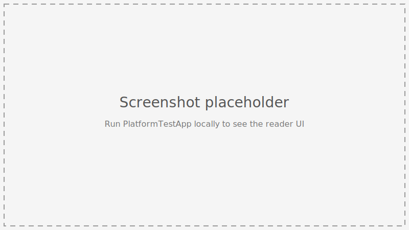

# PlatformTestApp

A working Blazor Server sample app for the [YouVersion Platform SDK for .NET](../README.md). It
exists to prove — and show you — that the SDK components work together end to end: two different
ways to build a Bible reader, a full OAuth/PKCE sign-in flow, and click-to-highlight, all wired up
against a real host app instead of a unit test.

It is the `PlatformTestApp` linked from the [repository README](../README.md) and referenced
throughout [`Platform.SDK.Components/README.md`](../Platform.SDK.Components/README.md) and the
[OAuth/PKCE guide](../docs/oauth-guide.md) as the reference implementation — this document explains
what it demonstrates and how to run it; the packages it consumes document their own APIs in depth.



*Placeholder — this SDK's primary surface is the API/component libraries themselves, not this sample
app, so a real screenshot isn't a priority. Run the app locally (below) to see the live UI.*

## What it demonstrates

| Page | Route | Shows |
|---|---|---|
| Pre-built Reader | `/` ([`Home.razor`](Components/Pages/Home.razor)) | The all-in-one [`BibleReader`](../Platform.SDK.Components/README.md#biblereader) component — version/book/chapter/verse pickers, sign-in, and highlighting in one drop-in component. |
| Custom Builder | `/custom-reader` ([`CustomReader.razor`](Components/Pages/CustomReader.razor)) | The same reading experience assembled by hand from the individual pickers ([`VersionPicker`](../Platform.SDK.Components/README.md#versionpicker), [`BookPicker`](../Platform.SDK.Components/README.md#bookpicker), [`ChapterPicker`](../Platform.SDK.Components/README.md#chapterpicker), [`VersePicker`](../Platform.SDK.Components/README.md#versepicker)) plus a direct `IPassageService` call and [`VerseComponent`](../Platform.SDK.Components/README.md#versecomponent) — the pattern to follow when `BibleReader`'s layout doesn't fit your app. |

Both pages also exercise:

- **OAuth/PKCE sign-in** via [`YouVersionAuth`](../Platform.SDK.Components/README.md#youversionauth) and the `/auth/login`, `/auth/logout`, and callback endpoints in [`Program.cs`](Program.cs) — the fully working reference implementation walked through step-by-step in the [OAuth/PKCE guide](../docs/oauth-guide.md).
- **The `highlights` Data Exchange permission** — a separate consent step from sign-in itself. Each
  page shows a "Grant highlights access" prompt when the user is signed in but hasn't approved it,
  and persists the grant per-browser-session so it survives reloads (see
  [`HighlightsPermissionStore`](Auth/HighlightsPermissionStore.cs) and [Enabling highlighting in a
  custom composition](../Platform.SDK.Components/README.md#enabling-highlighting-in-a-custom-composition)).

## Running it

Prerequisites:

- .NET 10 SDK
- A YouVersion app key, and (for sign-in) an OAuth client id + registered redirect URI, from the
  [YouVersion developer portal](https://developers.youversion.com)

Configure secrets with [.NET User Secrets](https://learn.microsoft.com/aspnet/core/security/app-secrets)
rather than committing them to `appsettings.json` (see [`Platform.API/README.md` §
Configuration & secrets](../Platform.API/README.md#configuration--secrets) for the full rationale):

```bash
cd PlatformTestApp
dotnet user-secrets init
dotnet user-secrets set "YouVersionApi:AppKey" "YOUR_APP_KEY"
dotnet user-secrets set "YouVersionOAuth:ClientId" "YOUR_CLIENT_ID"
dotnet user-secrets set "YouVersionOAuth:RedirectUri" "http://localhost:52413"
```

Then run it:

```bash
dotnet run --project PlatformTestApp
```

The app launches at `http://localhost:52413` (see [`Properties/launchSettings.json`](Properties/launchSettings.json)).
Read-only browsing works with just `YouVersionApi:AppKey` configured; sign-in and highlighting
additionally need the `YouVersionOAuth` values above.

> In `Development`, hitting `/?dev_signin=1&user_name=Test+User` signs in a synthetic session
> without a live OAuth round trip, so you can exercise the signed-in UI without OAuth credentials
> configured. See the comment above the corresponding branch in [`Program.cs`](Program.cs) — it's
> gated to `Development` only and must never be reachable in production.

## Project layout

| Path | Purpose |
|---|---|
| [`Program.cs`](Program.cs) | DI wiring (`AddYouVersionApiClients`, `AddYouVersionOAuth`, `AddYouVersionComponents`) and the OAuth callback middleware/minimal API endpoints — the reference implementation the [OAuth guide](../docs/oauth-guide.md) walks through. |
| [`Components/Pages/Home.razor`](Components/Pages/Home.razor) | The `/` all-in-one `BibleReader` demo. |
| [`Components/Pages/CustomReader.razor`](Components/Pages/CustomReader.razor) + [`.razor.cs`](Components/Pages/CustomReader.razor.cs) | The `/custom-reader` manual-composition demo. |
| [`Components/Layout/ReaderNav.razor`](Components/Layout/ReaderNav.razor) | Top nav switching between the two demo pages. |
| [`Auth/SessionTokenProvider.cs`](Auth/SessionTokenProvider.cs) | Example per-session `ITokenProvider` — required in any multi-user host, since the SDK's default `InMemoryTokenProvider` is a process-wide singleton. |
| [`Auth/CircuitSessionKeyAccessor.cs`](Auth/CircuitSessionKeyAccessor.cs) | Resolves a stable per-browser key for a live Blazor Server circuit, which has no `HttpContext` of its own after the initial request. |
| [`Auth/HighlightsPermissionStore.cs`](Auth/HighlightsPermissionStore.cs) | Example per-session store for whether the `highlights` Data Exchange permission has been granted. |

None of the `Auth/` types are part of the SDK — they're sample implementations of extension points
(`ITokenProvider`) and app-level state the SDK deliberately leaves to the host, because both are
inherently host-specific (session/cache backend, multi-user isolation strategy).

## Related documentation

- [Repository README](../README.md) — package overview and which package(s) you need.
- [`Platform.API/README.md`](../Platform.API/README.md) — API clients, configuration, OAuth setup.
- [`Platform.SDK.Services/README.md`](../Platform.SDK.Services/README.md) — business-logic services this app injects (`IPassageService`, `IBibleReaderStateService`, etc.).
- [`Platform.SDK.Components/README.md`](../Platform.SDK.Components/README.md) — full component reference for everything used on these two pages.
- [OAuth/PKCE guide](../docs/oauth-guide.md) — step-by-step walkthrough of the sign-in flow implemented in `Program.cs`.

## License

MIT — see [LICENSE](../LICENSE).
