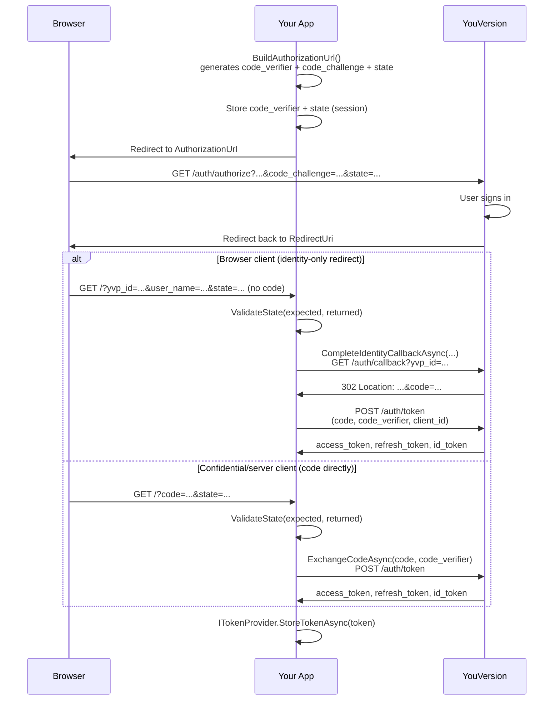

# OAuth 2.0 + PKCE Guide

This document walks through exactly how `Platform.API`'s OAuth client signs a user in, step by
step, with the actual code involved at each stage. It covers the authorization-code + PKCE flow,
the two shapes YouVersion's callback can take, token storage, and automatic refresh.

If you just want copy/paste setup, see [`Platform.API/README.md`](../Platform.API/README.md#oauth-setup-optional).
This guide explains *why* each step exists and *what happens under the hood*.

## Why PKCE

Authorization-code + PKCE (Proof Key for Code Exchange, [RFC 7636](https://www.rfc-editor.org/rfc/rfc7636))
is the OAuth 2.0 flow for clients that can't safely hold a secret — a Blazor Server app, a SPA, or
a mobile app. Instead of a pre-shared client secret proving the token-exchange request came from
your app, the app proves it holds the *same process* that started the sign-in:

1. Before redirecting the user, the app generates a random secret (`code_verifier`) and sends only
   a hash of it (`code_challenge`) in the authorization redirect.
2. When redeeming the authorization code afterward, the app sends the original `code_verifier`.
3. The authorization server hashes it and checks it matches the `code_challenge` it was given
   earlier — proving the redemption request came from whoever started the flow, without ever
   putting a long-lived secret in client-side code.

Every piece of this — generating the verifier/challenge, building the redirect, redeeming the
code, storing and refreshing the resulting tokens — is handled by
[`IYouVersionOAuthClient`](../Platform.API/OAuth/IYouVersionOAuthClient.cs), the interface this
guide walks through.

## The moving pieces

| Term | What it is |
|---|---|
| `code_verifier` | 32 random bytes, Base64Url-encoded. Kept secret, held server-side across the redirect. |
| `code_challenge` | SHA-256 hash of the verifier, Base64Url-encoded. Sent in the authorization URL — safe to expose. |
| `state` | Random opaque string round-tripped through the redirect to detect CSRF (a forged callback from somewhere other than the redirect you issued). |
| `nonce` | Random value included in the authorization request; passed through to the ID token as replay protection (standard OIDC practice). |
| authorization code | A short-lived, one-time-use code the authorization server hands back after the user signs in. Traded for tokens — never used directly. |
| access token | Sent as `Authorization: Bearer <token>` on API calls that need the signed-in user's identity (e.g. writing a highlight). |
| refresh token | Long-lived credential used to obtain a new access token without the user signing in again. |
| id token | An OIDC JWT carrying the user's identity claims (name, email, subject). Not used for API calls. |

## The full flow



The **identity-only redirect** is the shape most browser-based apps (including the sample
`PlatformTestApp`) actually receive — see [Step 4](#step-4-handle-the-callback) below for why
there are two shapes and how each is handled.

---

## Step 1 — Configure the SDK

Register the API clients first, then OAuth (the order is enforced — `AddYouVersionOAuth` throws
`InvalidOperationException` if `AddYouVersionApiClients` hasn't run yet):

```csharp
builder.Services
    .AddYouVersionApiClients(builder.Configuration)
    .AddYouVersionOAuth(options =>
    {
        options.ClientId = builder.Configuration["YouVersionOAuth:ClientId"]!;
        options.RedirectUri = new Uri(builder.Configuration["YouVersionOAuth:RedirectUri"]!);
        options.Scopes = "openid profile email";
    });
```

`YouVersionOAuthOptions` ([`Platform.API/OAuth/YouVersionOAuthOptions.cs`](../Platform.API/OAuth/YouVersionOAuthOptions.cs))
binds from the `YouVersionOAuth` configuration section and controls every endpoint the flow talks to:

| Option | Default | Notes |
|---|---|---|
| `ClientId` | *(required)* | Your registered client id. YouVersion apps can reuse their app key as the client id. |
| `RedirectUri` | `null` | Must match a URI registered in the developer portal. |
| `AuthorizationEndpoint` | `https://api.youversion.com/auth/authorize` | Where `BuildAuthorizationUrl` sends the user. |
| `AuthCallbackEndpoint` | `https://api.youversion.com/auth/callback` | Used internally by `CompleteIdentityCallbackAsync` — see Step 4. |
| `TokenEndpoint` | `https://api.youversion.com/auth/token` | Where codes and refresh tokens are redeemed. |
| `Scopes` | `"openid profile email"` | The only scopes YouVersion's sign-in API supports. There is no scope for resource permissions like `highlights` — those go through the separate Data Exchange flow (see [below](#requesting-additional-permissions-data-exchange)). |
| `OAuthTokenExpiryBufferSeconds` | `60` | How early `OAuthBearerTokenHandler` proactively refreshes (Step 9). |

## Step 2 — Build the authorization URL

Call `BuildAuthorizationUrl` to generate a fresh PKCE pair and the redirect URL in one step
([`YouVersionOAuthClient.cs:44-92`](../Platform.API/OAuth/YouVersionOAuthClient.cs)):

```csharp
var state = GenerateRandomState(); // your own random string, or omit to let the SDK generate one
var authRequest = oauthClient.BuildAuthorizationUrl(state, requestedPermissions: null);

// Persist BOTH of these server-side (e.g. session) — you need them again after the redirect:
session.SetString("pkce_verifier", authRequest.Pkce.CodeVerifier);
session.SetString("oauth_state", state);

return Results.Redirect(authRequest.AuthorizationUrl.AbsoluteUri);
```

Internally this:

1. Generates the PKCE pair: 32 random bytes → `code_verifier`, `SHA256(code_verifier)` →
   `code_challenge` (always method `S256`).
2. Generates a `nonce` (24 random bytes) and a `state` if you didn't supply one (16 random bytes),
   both Base64Url-encoded.
3. Forces `openid` into the scope list if it's missing (required for the callback to carry
   identity claims).
4. Builds the query string: `response_type=code`, `client_id`, `redirect_uri` (if configured),
   `nonce`, `state`, `code_challenge`, `code_challenge_method=S256`, `scope`, and optionally
   repeated `requested_permissions` entries.

**What you must keep:** `AuthorizationRequest.Pkce.CodeVerifier` and the `state` value. Nothing
else from this step needs to survive the redirect — the challenge and nonce are already embedded
in the URL you're about to send the browser to.

## Step 3 — Redirect the user

Send the browser to `authRequest.AuthorizationUrl`. The user authenticates with YouVersion, and
YouVersion redirects back to your `RedirectUri`.

## Step 4 — Handle the callback

This is the part that trips people up: **YouVersion's redirect back does not always carry a
redeemable `code`.** There are two shapes, and your callback route needs to handle both.

### Shape A — Browser clients: identity-only redirect (the common case)

The redirect carries identity fields instead of a code:

```
GET /?yvp_id=...&user_name=...&user_email=...&profile_picture=...&state=...
```

`yvp_id` is the reliable discriminator — only a genuine YouVersion redirect sets it. To finish
signing in, validate `state` and then call `CompleteIdentityCallbackAsync`
([`YouVersionOAuthClient.cs:141-199`](../Platform.API/OAuth/YouVersionOAuthClient.cs)), which does
the remaining two hops **for you**:

```csharp
if (!oauthClient.ValidateState(expectedState, returnedState))
{
    // reject — possible CSRF, or an expired session
}

var token = await oauthClient.CompleteIdentityCallbackAsync(
    state: returnedState,
    yvpId: yvpId,
    userName: userName,
    userEmail: userEmail,
    profilePicture: profilePicture,
    codeVerifier: storedCodeVerifier);
```

Under the hood, `CompleteIdentityCallbackAsync`:

1. Sends those identity fields as a `GET` to `AuthCallbackEndpoint`
   (`https://api.youversion.com/auth/callback`).
2. Reads the real authorization `code` out of that response's `Location` header (the OAuth client
   is registered with `AllowAutoRedirect = false` specifically so this header is inspectable
   instead of being followed automatically).
3. Calls `ExchangeCodeAsync` (Shape B, below) with that code — so you end up with a real token
   either way.

### Shape B — Confidential/server clients: code directly

The redirect carries a redeemable code directly:

```
GET /?code=...&state=...
```

Validate `state`, then redeem the code yourself:

```csharp
if (!oauthClient.ValidateState(expectedState, returnedState))
{
    // reject
}

var token = await oauthClient.ExchangeCodeAsync(code, storedCodeVerifier);
```

### CSRF check: `ValidateState`

Both shapes must validate `state` before doing anything else
([`YouVersionOAuthClient.cs:95-107`](../Platform.API/OAuth/YouVersionOAuthClient.cs)):

```csharp
public bool ValidateState(string? expectedState, string? actualState)
{
    if (string.IsNullOrEmpty(expectedState) || string.IsNullOrEmpty(actualState))
        return false;

    // constant-time comparison — state is a public query parameter, but the callback
    // handler itself is a security boundary, so this is still done properly
    return CryptographicOperations.FixedTimeEquals(...);
}
```

A missing `expectedState` (e.g. an expired session) **fails** the check — it is never treated as
"nothing to verify."

### Reference implementation

[`PlatformTestApp/Program.cs`](../PlatformTestApp/Program.cs) is the fully working example. Key
pieces:

- `RedirectToAuthorize` (~line 242) — calls `BuildAuthorizationUrl` and stashes
  `pkce_verifier`/`oauth_state` in session before redirecting.
- Middleware branch on `ctx.Request.Query.ContainsKey("yvp_id")` (~line 135) — Shape A, calls
  `CompleteIdentityCallbackAsync`.
- Middleware branch on `ctx.Request.Query.ContainsKey("code")` (~line 89) — parks the code in
  session and redirects to `/auth/callback-complete` (~line 274), which validates state and calls
  `ExchangeCodeAsync` — Shape B.

Because a top-level OAuth redirect only has a real `HttpContext`/session in a minimal-API endpoint
(not inside a live Blazor circuit), the callback is handled as plain ASP.NET Core middleware/minimal
APIs, not a Razor component.

## Step 5 — Token exchange (what actually goes over the wire)

Both `ExchangeCodeAsync` and the refresh path (Step 8) share one helper,
`PostTokenRequestAsync`, which POSTs form-encoded data to `TokenEndpoint`
(`https://api.youversion.com/auth/token`):

**Authorization code grant:**

```
POST /auth/token
Content-Type: application/x-www-form-urlencoded

grant_type=authorization_code
&client_id=<ClientId>
&code=<code>
&code_verifier=<code_verifier>
&redirect_uri=<RedirectUri>          (only if configured)
```

The response is deserialized into `OAuthTokenResponse` and immediately persisted via
`ITokenProvider.StoreTokenAsync` — you don't need to store it yourself.

## Step 6 — What you get back

[`OAuthTokenResponse`](../Platform.API/OAuth/OAuthTokenResponse.cs):

```csharp
public sealed record OAuthTokenResponse
{
    public string AccessToken { get; init; }
    public string? RefreshToken { get; init; }
    public string? IdToken { get; init; }
    public string TokenType { get; init; } = "Bearer";
    public int ExpiresIn { get; init; }

    [JsonIgnore] // NOT serialized — see the storage warning below
    public DateTimeOffset ReceivedAt { get; init; } = DateTimeOffset.UtcNow;

    public bool IsExpired(int bufferSeconds = 60);
    public string? GetClaim(string claimName);
    public string? GetUserName();
    public string? GetEmail();
    public string? GetDisplayIdentity();
}
```

`IsExpired` compares against `ReceivedAt + ExpiresIn` (with a buffer), falling back to decoding the
`exp` claim from the `IdToken`/`AccessToken` JWT if the server didn't send `expires_in`. The
`GetUserName`/`GetEmail`/`GetDisplayIdentity` helpers decode the ID token's claims — no signature
verification is performed, because the token came directly from a trusted HTTPS response, not from
an untrusted third party.

> **`ReceivedAt` is `[JsonIgnore]`.** If you persist a token yourself (see Step 7), you must
> carry `ReceivedAt` alongside it manually — deserializing without it resets the clock to "now"
> and makes a token that's about to expire look freshly issued.

## Step 7 — Token storage

Tokens are persisted through the pluggable [`ITokenProvider`](../Platform.API/OAuth/ITokenProvider.cs):

```csharp
public interface ITokenProvider
{
    Task<OAuthTokenResponse?> GetTokenAsync(CancellationToken cancellationToken = default);
    Task StoreTokenAsync(OAuthTokenResponse token, CancellationToken cancellationToken = default);
    Task ClearTokenAsync(CancellationToken cancellationToken = default);
}
```

`AddYouVersionOAuth` registers `InMemoryTokenProvider` via `TryAddSingleton` if nothing else was
registered first. **This default is a process-wide singleton** — fine for a single-user CLI tool,
but in any multi-user host (Blazor Server, a web app) it leaks one user's token to every other
user on the same process.

For anything multi-user, register your own scoped provider **before** `AddYouVersionOAuth`:

```csharp
builder.Services.AddScoped<ITokenProvider, MyPerUserTokenProvider>();
builder.Services.AddYouVersionOAuth(o => { ... });
```

The registration order matters because of `TryAddSingleton` semantics — if OAuth is registered
first, the library's default wins and your registration is a no-op.

`PlatformTestApp` ships a complete per-session example,
[`SessionTokenProvider`](../PlatformTestApp/Auth/SessionTokenProvider.cs), that stores the token
(with `ReceivedAt` carried alongside, per the warning above) in `IDistributedCache` keyed by a
stable per-browser id from
[`CircuitSessionKeyAccessor`](../PlatformTestApp/Auth/CircuitSessionKeyAccessor.cs) — necessary
because a live Blazor Server circuit has no `HttpContext` to fall back on after the initial
request that stored the token.

## Step 8 — Using the token / automatic refresh

Once a token is stored, [`OAuthBearerTokenHandler`](../Platform.API/Http/OAuthBearerTokenHandler.cs)
(a `DelegatingHandler` appended to the highlight client's HTTP pipeline) attaches it automatically:

1. Reads the current token from `ITokenProvider`.
2. If `token.IsExpired(OAuthTokenExpiryBufferSeconds)` (default: within 60s of expiry), transparently
   calls `RefreshTokenAsync` before proceeding.
3. Attaches `Authorization: Bearer <access_token>` to the outgoing request.
4. If no refresh token is available, logs a warning and lets the request go out unauthenticated
   rather than throwing.

Concurrent requests that all observe an expired token at once are coalesced into a **single**
refresh call (`GetOrStartRefreshAsync`) so they don't race each other and invalidate one another's
refresh token.

You generally don't need to think about this — call your API clients normally and the bearer
token is attached and kept fresh for you.

## Step 9 — Manual refresh

If you need to refresh proactively (e.g. before a long-running background job), call
`RefreshTokenAsync` directly:

```csharp
var token = await oauthClient.RefreshTokenAsync();
```

This POSTs `grant_type=refresh_token&refresh_token=<refresh_token>` to the same token endpoint and
re-stores the result. Throws `InvalidOperationException` if no refresh token is on file — at that
point the user must sign in again.

## Step 10 — Sign out

```csharp
await oauthClient.SignOutAsync();
```

This clears the token via `ITokenProvider.ClearTokenAsync`. Also clear any of your own session
state (the reference app calls `HttpContext.Session.Clear()` alongside it).

## Requesting additional permissions (Data Exchange)

Signing in only grants identity (`openid profile email`) — it does **not** authorize access to
protected resources like highlights. That's a separate, explicit consent step called **Data
Exchange**. You can request a permission bundled into the same sign-in redirect
(`BuildAuthorizationUrl(state, requestedPermissions: ["highlights"])`) or afterward via
`RequestPermissionsAsync` + `BuildDataExchangeApprovalUrl`. This is a large enough topic on its own
that it's covered in full, with both callback shapes and code samples, in
[`Platform.API/README.md` § Data Exchange](../Platform.API/README.md#data-exchange-resource-permissions) —
worth reading once the core sign-in flow above is working.

## Troubleshooting

| Symptom | Cause |
|---|---|
| `InvalidOperationException` mentioning `AddYouVersionApiClients` | `AddYouVersionOAuth` was called before `AddYouVersionApiClients`. |
| Callback never carries `code`, only `yvp_id`/`user_name`/etc. | Expected — this is Shape A. Call `CompleteIdentityCallbackAsync`, not `ExchangeCodeAsync`, for this shape. |
| `ValidateState` always returns `false` | Check the session/store used to persist `state` between the redirect out and the callback — a common cause is losing session state across the external redirect (e.g. cookie not sent, session expired). |
| Token appears valid but `IsExpired` returns `true` immediately after loading from storage | `ReceivedAt` is `[JsonIgnore]` — your `ITokenProvider` must persist and restore it separately, or it resets to "now" (see Step 6) or, depending on direction, always looks stale. |
| One user's session shows another user's sign-in state | `InMemoryTokenProvider` (the default) is a process-wide singleton — register a scoped `ITokenProvider` before `AddYouVersionOAuth` (Step 7). |
| `RefreshTokenAsync` throws `InvalidOperationException` | No refresh token stored (never issued, or already cleared by sign-out) — user must sign in again. |
| `YouVersionApiException` with `401`/`403` on an API call | Token missing/expired/not authorized for that resource — for `highlights`, confirm the Data Exchange consent was actually granted, not just requested. |

## File reference

| File | Purpose |
|---|---|
| [`Platform.API/OAuth/IYouVersionOAuthClient.cs`](../Platform.API/OAuth/IYouVersionOAuthClient.cs) | Public interface — the entire flow's API surface. |
| [`Platform.API/OAuth/YouVersionOAuthClient.cs`](../Platform.API/OAuth/YouVersionOAuthClient.cs) | Implementation: PKCE generation, URL building, code exchange, refresh, Data Exchange. |
| [`Platform.API/OAuth/YouVersionOAuthOptions.cs`](../Platform.API/OAuth/YouVersionOAuthOptions.cs) | Configuration (client id, endpoints, scopes, refresh buffer). |
| [`Platform.API/OAuth/OAuthTokenResponse.cs`](../Platform.API/OAuth/OAuthTokenResponse.cs) | Token shape, expiry check, claim helpers. |
| [`Platform.API/OAuth/OAuthModels.cs`](../Platform.API/OAuth/OAuthModels.cs) | `PkceValues` (verifier/challenge/method). |
| [`Platform.API/OAuth/AuthorizationRequest.cs`](../Platform.API/OAuth/AuthorizationRequest.cs) | Return type of `BuildAuthorizationUrl` (URL + PKCE values). |
| [`Platform.API/OAuth/ITokenProvider.cs`](../Platform.API/OAuth/ITokenProvider.cs) | Pluggable token storage abstraction. |
| [`Platform.API/OAuth/InMemoryTokenProvider.cs`](../Platform.API/OAuth/InMemoryTokenProvider.cs) | Default (process-wide singleton) storage. |
| [`Platform.API/Http/OAuthBearerTokenHandler.cs`](../Platform.API/Http/OAuthBearerTokenHandler.cs) | Transparent bearer-header attachment + single-flight refresh. |
| [`Platform.API/Extensions/ServiceCollectionExtensions.cs`](../Platform.API/Extensions/ServiceCollectionExtensions.cs) | `AddYouVersionApiClients` / `AddYouVersionOAuth` DI wiring. |
| [`Platform.SDK.Components/Auth/YouVersionAuth.razor`](../Platform.SDK.Components/Auth/YouVersionAuth.razor) | Reusable Blazor sign-in/out widget. |
| [`PlatformTestApp/Program.cs`](../PlatformTestApp/Program.cs) | Full reference implementation of both callback shapes. |
| [`PlatformTestApp/Auth/SessionTokenProvider.cs`](../PlatformTestApp/Auth/SessionTokenProvider.cs) | Example per-session `ITokenProvider` for multi-user hosts. |
| [`Platform.API.Tests/OAuth/OAuthClientTests.cs`](../Platform.API.Tests/OAuth/OAuthClientTests.cs) | Exhaustive behavior reference (query shapes, edge cases, error handling). |
